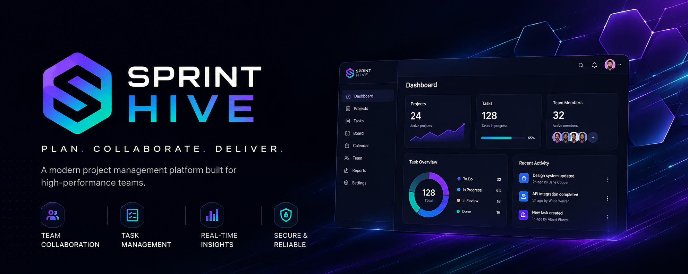

# 🚀 SprintHive
<p align="center">
  
</p>
A production-grade SaaS Project Management Platform built with the MERN Stack that helps teams collaborate, manage projects, track tasks, and monitor progress in a secure and scalable environment.


---

## 📖 Overview

SprintHive is a full-stack project management platform designed to simplify team collaboration and project execution. It provides secure authentication, organization management, task tracking, dashboards, and real-time collaboration through a modern and scalable architecture.

This project demonstrates production-level backend architecture, RESTful API development, authentication, authorization, and full-stack application development using the MERN stack.

---

## ✨ Features

- 🔐 Secure User Authentication (JWT)
- 👥 Organization & Workspace Management
- 📋 Project Management
- ✅ Task Assignment & Tracking
- 📊 Dashboard & Analytics
- 👤 User Profile Management
- 🔒 Role-Based Access Control
- 📅 Task Status Management
- ⚡ RESTful API Architecture
- 🌐 Responsive User Interface

---

## 🛠️ Tech Stack

### Frontend

- React.js
- JavaScript
- CSS
- Axios

### Backend

- Node.js
- Express.js
- JWT Authentication
- REST API

### Database

- MongoDB
- Mongoose

---

## 📂 Project Structure

```
SprintHive
│
├── client/
│   ├── src/
│   ├── public/
│   └── package.json
│
├── backend/
│   ├── controllers/
│   ├── middleware/
│   ├── models/
│   ├── routes/
│   ├── config/
│   └── server.js
│
└── README.md
```

---

## 🚀 Installation

### Clone Repository

```bash
git clone https://github.com/yourusername/SprintHive.git
```

### Install Dependencies

Frontend

```bash
cd client
npm install
```

Backend

```bash
cd backend
npm install
```

### Configure Environment Variables

Create a `.env` file inside the backend folder.

```
MONGODB_URI=Your_MongoDB_URI
JWT_SECRET=Your_JWT_SECRET
```

### Start Backend

```bash
npm run dev
```

### Start Frontend

```bash
npm start
```

---

## 📸 Screenshots

Add screenshots here.

Example:

- Login Page
- Dashboard
- Project Page
- Task Management
- Analytics

---

## 🎯 Learning Outcomes

This project helped strengthen my understanding of:

- MERN Stack Development
- REST API Design
- JWT Authentication
- MongoDB Data Modeling
- Backend Architecture
- Protected Routes
- State Management
- Project Structuring
- Full Stack Development

---

## 🔮 Future Improvements

- Real-Time Notifications
- Team Chat
- Calendar Integration
- File Attachments
- Activity Timeline
- Email Notifications
- Kanban Board
- Dark Mode

---

## 👨‍💻 Author

**Prajin M**

Computer Science Engineering Student

GitHub: https://github.com/Prajin2k

---

## ⭐ Support

If you found this project helpful, consider giving it a ⭐ on GitHub.
