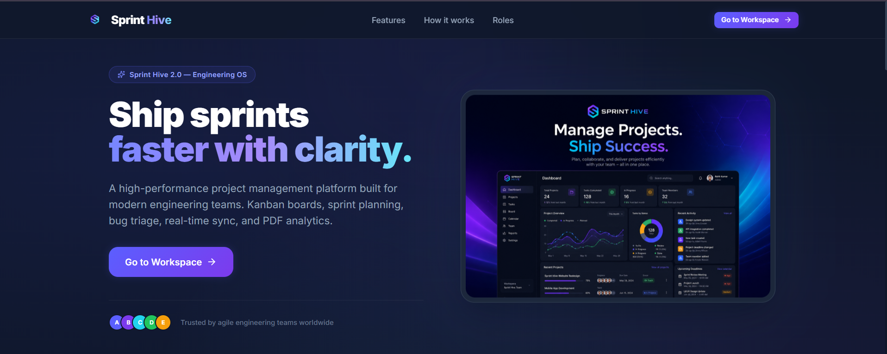
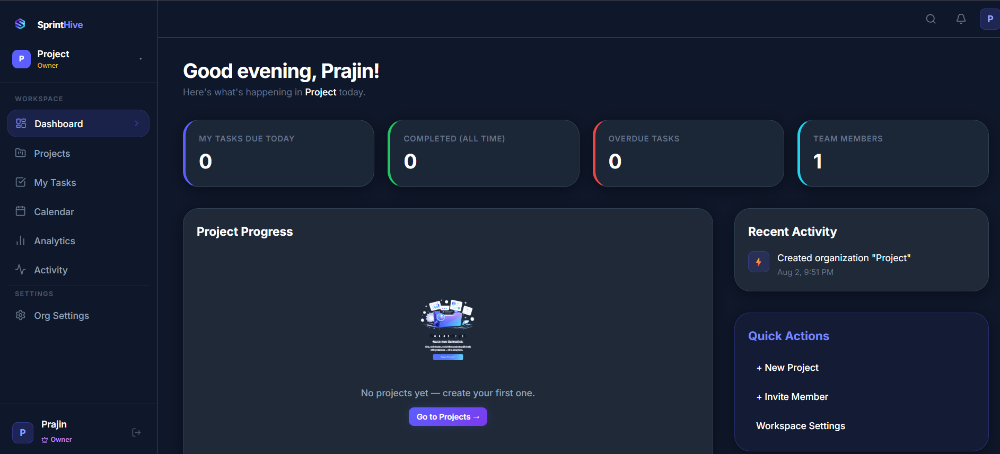
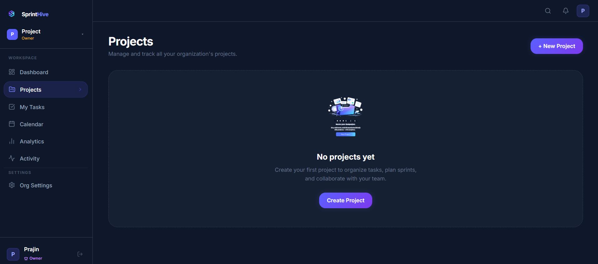
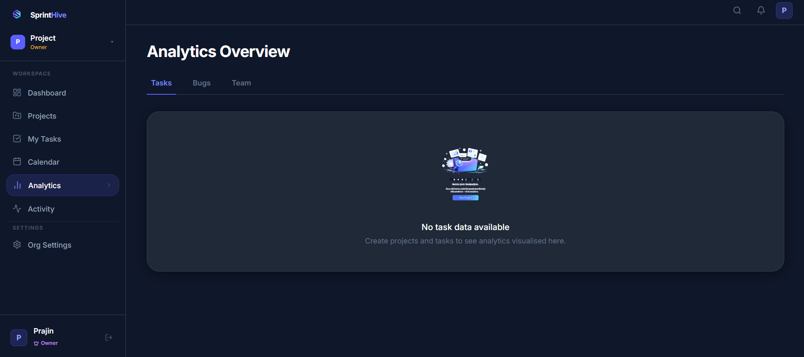

<p align="center">
  
</p>
<h1 align="center">Sprint Hive</h1>

<p align="center">
A production-grade SaaS Project Management Platform built with the MERN Stack.
</p>

<p align="center">
Secure Authentication • Organization Management • RBAC • Sprint Planning • Analytics
</p>

<p align="center">
  
  
  
  
  
</p>

---

##  Overview

Sprint Hive is a production-grade SaaS project management platform built with the MERN stack. It enables teams to collaborate through organization workspaces, manage projects and sprints, assign tasks, track bugs, and monitor progress using a modern and scalable architecture.

The project demonstrates full-stack application development, secure authentication, role-based authorization, RESTful API design, and scalable frontend architecture.

---

##  Features

- JWT Authentication with Refresh Tokens
- Email Verification & Password Reset
- Organization & Workspace Management
- Project, Sprint & Task Management
- Bug Tracking Workflow
- Role-Based Access Control (RBAC)
- Analytics Dashboard
- Responsive SaaS-inspired UI

---
##  Architecture

Client (React + Redux Toolkit)
        │
        ▼
REST API (Express.js)
        │
        ▼
MongoDB Database

---

## 🛠️ Tech Stack

### Frontend

- React.js
- Redux Toolkit
- Tailwind CSS
- Axios

### Backend

- Node.js
- Express.js
- JWT Authentication
- Nodemailer

### Database

- MongoDB
- Mongoose

---

## 📡 Backend Highlights

- RESTful API Design
- JWT Authentication
- Role-Based Access Control (RBAC)
- Organization-based Authorization
- Modular MVC Architecture
- Protected Routes
- MongoDB Aggregation

---

## 📂 Project Structure

```
SprintHive
│
backend
│
├── config
├── controllers
├── middleware
├── models
├── routes
├── services
├── utils
└── server.js

client
│
├── components
├── hooks
├── pages
├── services
├── store
├── assets
└── App.jsx
│
└── README.md
```

---

##  Installation

### Clone Repository

```bash
git clone https://github.com/Prajin2k/SprintHive.git
```
### Install Dependencies

Frontend

```bash
cd client
npm install
```

Backend

```bash
cd backend
npm install
```

### Configure Environment Variables

Create a `.env` file inside the backend folder.

```
MONGODB_URI=Your_MongoDB_URI
JWT_SECRET=Your_JWT_SECRET
```

### Start Backend

```bash
npm run dev
```

### Start Frontend

```bash
npm start
```

---

## Screenshots

| Landing Page | Dashboard |
|--------------|-----------|
|  |  |

| Projects | Analytics |
|----------|-----------|
|  |  |

##  Learning Outcomes

This project helped strengthen my understanding of:

Building Sprint Hive strengthened my understanding of full-stack application architecture, authentication and authorization, REST API design, MongoDB schema modeling, Redux Toolkit state management, and scalable software development practices.

---

##  Future Improvements

- Advanced Role-Based Access Control
- Real-time Notifications
- Team Chat
- Calendar Integration
- File Attachments
- Activity Timeline
- CI/CD Pipeline
- Docker Support
- Live Deployment

---

##  Why Sprint Hive?

Sprint Hive was built to explore how modern SaaS applications are designed. Instead of creating a basic CRUD application, the goal was to implement features commonly found in real-world project management platforms, including authentication, organization workspaces, RBAC, sprint management, analytics, and scalable backend architecture.

---

##  Author

**Prajin M**

Computer Science Engineering Student | MERN Stack Developer

GitHub: https://github.com/Prajin2k
LinkedIn: https://www.linkedin.com/in/prajin-m

---
## ⭐ Support

If you found this project useful, consider giving it a star on GitHub. Feedback, suggestions, and contributions are always welcome.
---
##  Live Demo
Deployment is planned. The live demo will be added after production deployment.
